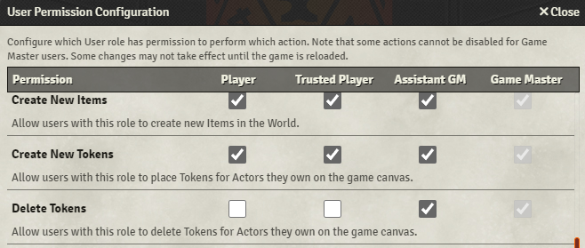

# [Allow Players to Delete Their Tokens](https://foundryvtt.com/packages/allow-players-to-delete-their-tokens/)

# Allow Players to Delete Their Tokens

Based on [Player Token Permissions Extended](https://github.com/VanceCole/player-token-permissions/), but simplified a lot.

- Lets players delete tokens they have selected by pressing the regular delete key
- At least 1 GM player must be connected
- A confirmation message will appear (unless you hold Shift)

(note:  unlike the original PTPE module, the token needs to be selected (not hovered/targeted), and
deleting tokens on other scenes is fine)

# Note - This module is unnecessary as of Foundry V10!

Now Foundry includes a built-in permission to delete tokens.  It doesn't have a confirmation message but it's close enough.

